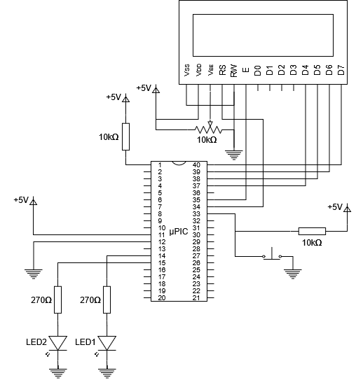

# LCD_PIC16F917
Este proyecto muestra en un LCD y LEDs el valor de una variabe entera aleatorea de 0 a 3 cada vez que se preciona un botón.
## Circuito



## Demostración de funcionamiento


## Cálculos previos

### Cálculo del TMR1
Se tienen los siguientes datos:

- Periodo de la interrupción: **T = 100 ms**
- Frecuencia del oscilador interno: **$F_{OSC} = 8 \text{ MHz}$**
- Prescaler: **1:4**

Aplicando la fórmula del TMR1 se tiene:

$$
T = \frac{4 \cdot \text{PRESCALER}}{F_{OSC}} \cdot (65535 - TMR1)
$$

Reemplazando los datos, el número con el que se tiene que cargar al registro es:

$$
TMR1 = 15535
$$

---
## Pseudocódigo

```c
//Configuracion de los fusibles

Delay con oscilador interno ← 8MHz
MCLR activado
WDT desactivado
Protección de codigo desactivada
Brown-out desactivado

//Configuracion del oscilador

Interno de alta frecuencia
Fosc ← 8MHz

//Configuracion de los pines

RB0 (button) → entrada
RB1 (LCD_RS) → salida
RB2 (LCD_ENABLE) → salida
RB4 (LCD_DATA4) → salida
RB5 (LCD_DATA5) → salida
RB6 (LCD_DATA6) → salida
RB7 (LCD_DATA7) → salida
button ← 0
PORTB<1-7> ← 0

//Configuracion del TMR1

Fuente ← Fosc/4
Prescaler ← 4
TMR1 ← 15535

//Configuracion de las interrupciones

INTCON.GIE ← 1      // Global interrupt enable
INTCON.PEIE ← 1     // Peripheral interrupt enable
INTCON.INT0IE ← 1   // External interrupt enable
PIE1.TMR1IE ← 1     // TMR1 interrupt enable

//LCD
Inicializar LCD
delay_ms(10)
Posicionar LCD en (1, 1)
Imprimir "El valor de x es"


//Bucle principal
Hacer nada.

// INTERRUPCIÓN EXTERNA (RB0)
Esperar 20 ms (antirrebote)
Si RB0 = 0:
    PORTB<0-1> ← x
    Posicionar LCD en (1, 2)
    Imprimir valor de x
Limpiar bandera INT

// INTERRUPCIÓN TMR1
x ← x + 1
x ← x % 4
Recargar TMR1 ← 15535
Limpiar bandera TMR1

```
## Código Main
```c
#include "source.h"
#include "funciones.h"

int main(){
   configuraciones();
   while(1);
   return 0;
}
```
## Código Source
```c
#include <16F917.h>
#device *=16
#device adc = 8

#fuses MCLR
#fuses NOWDT
#fuses INTRC_IO
#fuses NOPUT
#fuses NOPROTECT
#fuses NOCPD
#fuses NOBROWNOUT
#fuses IESO
#fuses FCMEN
#fuses NODEBUG

#use delay(clock=8M)

#byte PORTB = 0x06
#byte TRISB = 0x86
#byte PORTC = 0x07
#byte TRISC = 0x87

#byte OPTION_REG = 0x181
#byte INTCON = 0x8B
#byte PIE1 = 0x8C
#byte PIR1 = 0x0C
#byte T1CON = 0x10
#byte TMR1L = 0x0E
#byte TMR1H = 0x0F

#byte OSCCON = 0x8F
```
## Código Funciones
```c
#include "source.h"

#define LCD_ENABLE_PIN  PIN_B2                                    ////
#define LCD_RS_PIN      PIN_B1                                    ////
#define LCD_RW_PIN      PIN_E2                                    ////
#define LCD_DATA4       PIN_B4                                    ////
#define LCD_DATA5       PIN_B5                                    ////
#define LCD_DATA6       PIN_B6                                    ////
#define LCD_DATA7       PIN_B7 

#include <lcd.c>


int valorl, valorh, x=0;

#int_EXT
void interrupcion_externa(){
   delay_ms(20);	//antirrebote
   if(bit_test(PORTB,0)==0){
      PORTC=x;
      lcd_gotoxy(1, 2);		//Posicionamiento en la segunda fila
      printf(lcd_putc, "        %d        ", x);
   }
   bit_clear(INTCON,1);		//Limpiar flag
}

#int_TIMER1
void interrupcion_TMR1(){
   x++;
   x %= 4;
   TMR1H = valorh;
   TMR1L = valorl;
   bit_clear(PIR1,0);		//Limpiar flag
}

void configuraciones(){
   //Configuracion del oscilador
   bit_set(OSCCON,6);bit_set(OSCCON,5);bit_set(OSCCON,4);	//8 MHz
   bit_clear(OSCCON,3);		//Device is running from the internal system clock
   bit_set(OSCCON,2);		//HFINTOSC is stable
   bit_set(OSCCON,0);		//Internal oscillator is used for system clock
   //Configuracion de los pines
   TRISB |= 0b00000001;		//Pin RB0 como entrada
   TRISB &= 0b00000001;		//Pines RB1 al RB7 como salidas
   TRISC &= 0b00;		//Pines RC0 y RC1 como salidas
   PORTB &= 0b00000001;		//Pines RB1 al RB7 en 0
   PORTC &= 0b00;		//Pines RC0 y RC1 en 0
   //Configuracion de las interrupciones
   bit_clear(OPTION_REG,6);	//Interrupt on falling edge of RB0/INT/SEG0 pin
   
   bit_set(INTCON,7);		//Enables all unmasked interrupts
   bit_set(INTCON,6);		//Enables all unmasked peripheral interrupts
   bit_set(INTCON,5);		//Enables the TMR0 interrupt
   bit_set(INTCON,4);		//Enables the RB0/INT/SEG0 external interrupt
   
   bit_set(PIE1,0);		//TMR1 Overflow Interrupt Enable
   //1:4 Prescale Value
   bit_set(T1CON,5);bit_clear(T1CON,4);
   bit_clear(T1CON,1);		//Internal clock (F OSC/4)
   //Para alcanzar una interrupcion cada 100ms = 4*4*(65535-TMR1)/(8MHz)
   //Se llega a que el valor de TMR1 = 15535
   valorh = 15535 >> 8;
   valorl = 15535 & 0xFF;
   TMR1H = valorh;
   TMR1L = valorl;
   bit_set(T1CON,0);		//Timer1 On
   
   lcd_init();			//Inicializacion de la LCD
   delay_ms(10);
   lcd_gotoxy(1, 1);		//Posicionamiento en la primera fila
   lcd_putc("El valor de x es");//Mensaje principal
}
