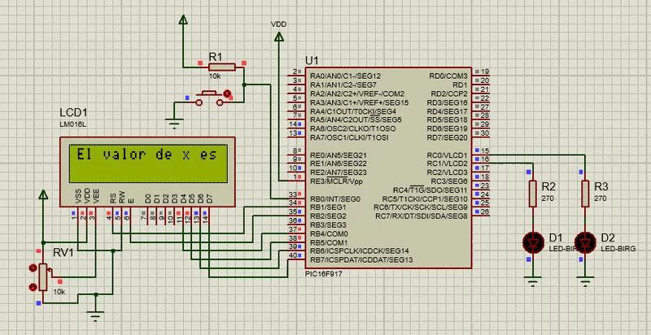

# LCD_PIC16F917
Este proyecto muestra en un LCD y LEDs el valor de una variabe entera aleatorea de 0 a 3 cada vez que se preciona un botón.
## Circuito

    

## Demostración de funcionamiento

## Cálculos previos

### Cálculo del TMR1
Se tienen los siguientes datos:

- Periodo de la interrupción: **T = 100 ms**
- Frecuencia del oscilador interno: **$F_{OSC} = 8 \text{ MHz}$**
- Prescaler: **1:4**

Aplicando la fórmula del TMR1 se tiene:

$$
T = \frac{4 \cdot \text{PRESCALER}}{F_{OSC}} \cdot (65535 - TMR1)
$$

Reemplazando los datos, el número con el que se tiene que cargar al registro es:

$$
TMR1 = 15535
$$

---
